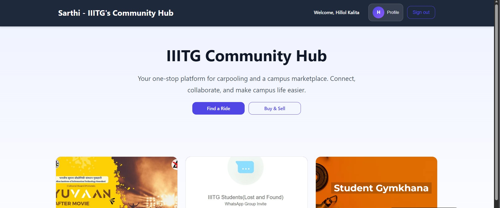
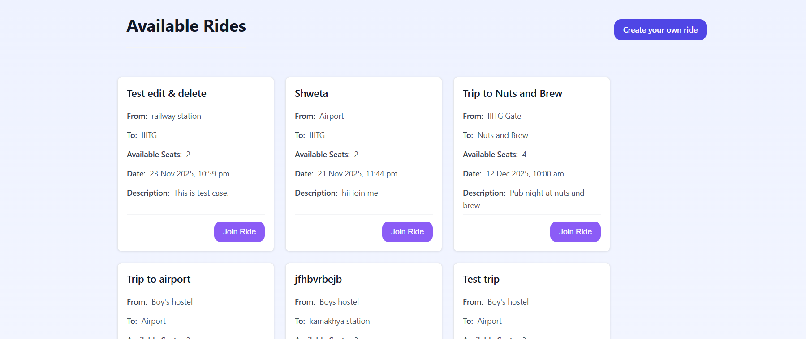
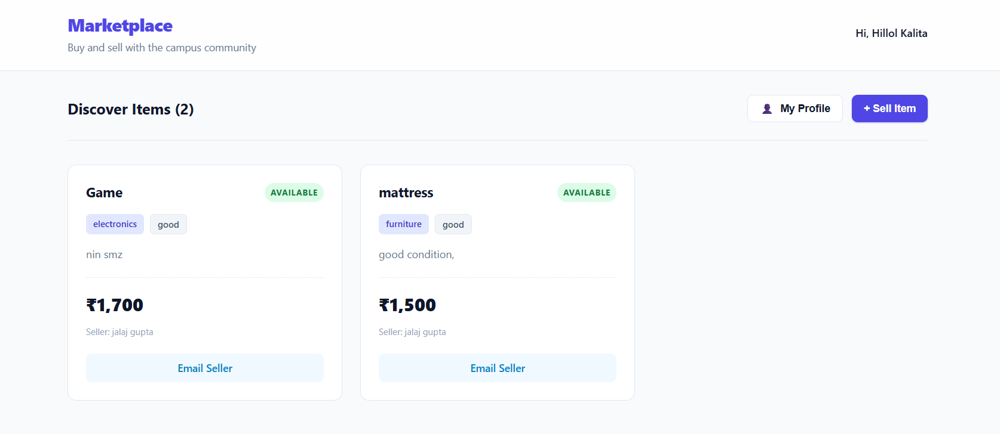
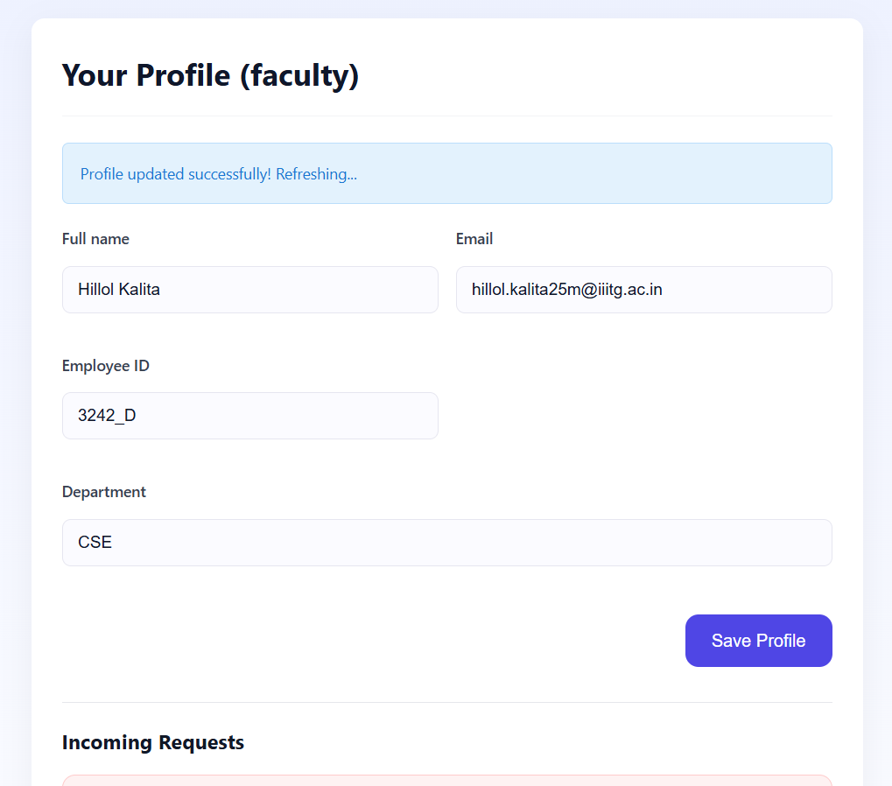
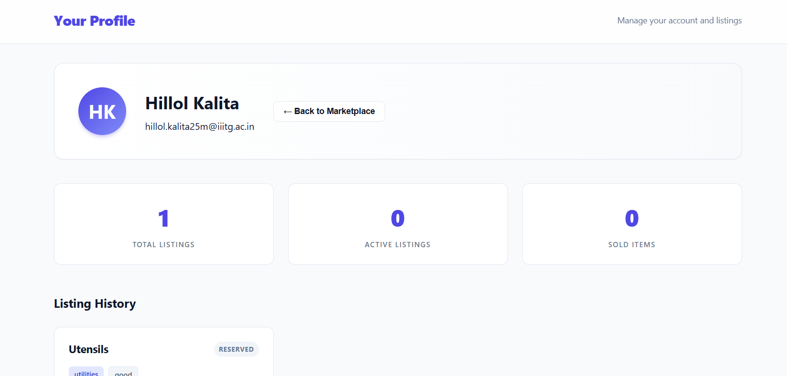
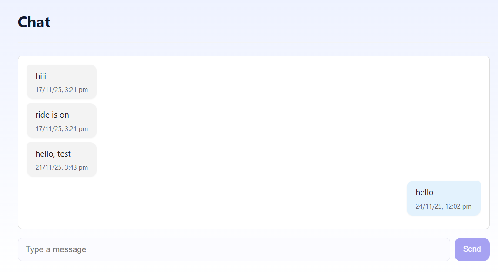

# Sarthi - IIITG Community Hub

Sarthi is a comprehensive microservices-based web application designed for the IIIT Guwahati community. It bridges the gap between students, faculty, and staff by providing essential campus utilities like peer-to-peer carpooling and a dedicated marketplace.

---

## Table of Contents

- [Requirement Analysis](#1-requirement-analysis)
- [Design](#2-design-microservices-architecture)
- [Development](#3-development-mern-stack)
- [Integration](#4-integration)
- [Testing](#5-testing)
- [Production](#6-production-docker--render)
- [Getting Started](#getting-started)
- [Screenshots](#screenshots)
- [Documentation](#documentation)
- [Contributing](#contributing)
- [License](#license)
- [Report](docs/Report.pdf)
---

## 1. Requirement Analysis

The application was built to address specific needs within the campus ecosystem, focusing on trust and role-based access.

**📄 Detailed Requirements:**
- [Software Requirements Specification v1.0](docs/SRS_v1.pdf)
- [Software Requirements Specification v2.0](docs/SRS_v2.pdf)

### Core Modules

* **Authentication & Roles**: Secure Google OAuth sign-in with distinct roles:
    * **Students**: Authenticated via domain-specific email (@iiitg.ac.in student domain).
    * **Faculty**: Authenticated via domain-specific email (@iiitg.ac.in faculty domain).
    * **Staff**: No domain-specific verification required.
* **Ride Sharing (Carpooling)**:
    * Post ride requests or offer rides.
    * Real-time status updates (Pending, Accepted, Rejected).
    * Integrated Chat for coordination between rider and driver.
* **Campus Marketplace**:
    * Buy and sell items within the trusted campus network.
    * Upload product images and details.
* **User Profiles**: Manage personal details, view outgoing/incoming requests, and history.

---

## 2. Design (Microservices Architecture)

The system follows a **Microservices Architecture**, separating concerns into distinct, independently deployable services.

**📐 Architecture Diagrams:**
- [High Level Diagram](docs/arthiHLDD.png)
- [Class diagram](docs/sarthi_class.png)
- [Use Case diagram](docs/sarthiUSECASE.png)
- [Design Doc](docs/design_doc_final.pdf)
### Service Breakdown

1. **Auth Service** (`/Back-end/auth-service`):
    * Handles Google OAuth via Passport.js strategies.
    * Manages user creation, role assignment, and JWT token issuance.
    * Connects to MongoDB `users` collection.
2. **Ride Service** (`/Back-end/ride-service`):
    * Manages ride listings, ride requests, and status updates.
    * **Socket.IO Server**: Handles real-time chat and live notifications for ride updates.
3. **Marketplace Service** (`/Back-end/marketplace-service`):
    * Handles product listings (CRUD operations).
    * Manages interactions between buyers and sellers.
4. **Frontend** (`/Front-end`):
    * Single Page Application (SPA) built with React & Vite.
    * Communicates with all three backend services via REST APIs.

---

## 3. Development (MERN Stack)

The application is built using the **MERN** stack, optimized for performance and scalability.

### Tech Stack

* **MongoDB (Atlas)**: Cloud-native NoSQL database for storing users, rides, chats, and market listings.
* **Express.js**: Lightweight backend framework used in all three microservices.
* **React.js (Vite)**: Fast, modern frontend library for the user interface.
* **Node.js**: Runtime environment for all backend services.

### Key Libraries

* **Frontend**: `axios` (API requests), `socket.io-client` (Real-time), `react-router-dom` (Navigation), `framer-motion` (Animations).
* **Backend**: `mongoose` (ODM), `passport-google-oauth20` (Auth), `socket.io` (WebSockets), `cors` (Cross-origin security).

---

## 4. Integration

Integration is handled through RESTful APIs and WebSockets, ensuring seamless communication between independent services.

* **API Gateway Pattern**: The Frontend acts as the consumer, routing requests to the appropriate microservice based on the URL path:
    * `/api/auth` → **Auth Service** (Port 5001)
    * `/api/rides` → **Ride Service** (Port 5003)
    * `/api/listings` → **Marketplace Service** (Port 5000)
* **Real-Time Communication**:
    * The **Ride Service** hosts a Socket.io server.
    * The Frontend connects to this socket to push chat messages and receive instant alerts when a ride request is accepted.
* **Environment Configuration**: Centralized configuration (`config.js`) dynamically switches between `localhost` for development and Render URLs for production.

---

## 5. Testing

We employ a robust testing strategy covering both API logic and End-to-End (E2E) user flows.

### Postman (API Testing)

* Collection: `Sarthi API.postman_collection.json`
* Tests cover:
    * User authentication flows.
    * CRUD operations for Rides and Marketplace listings.
    * Socket connection validation.

### Cypress (E2E Testing)

Located in `Front-end/cypress/e2e`, our suites simulate real user behavior:

1. `01-authentication.cy.js`: Verifies Google Login and Role selection.
2. `02-create-ride.cy.js`: Tests the flow of creating and publishing a ride.
3. `03-marketplace.cy.js`: Validates adding items to the marketplace.
4. `04-user-profile.cy.js`: Ensures profile updates persist correctly.
5. `05-error-handling.cy.js`: Checks system resilience against network failures or invalid inputs.

To run tests:

```bash
cd Front-end
npx cypress open
```

---

## 6. Production (Docker & Render)

The application is containerized and deployed to the cloud for accessibility.

### Docker

Each service includes its own Dockerfile, and the entire stack can be orchestrated locally using `docker-compose.yml`.

Run locally with Docker:

```bash
docker-compose up --build
```

### Deployment (Render)

The application is live on Render, split into four separate services:

* **Auth Web Service**: Node.js runtime.
* **Ride Web Service**: Node.js runtime.
* **Marketplace Web Service**: Node.js runtime.
* **Frontend Static Site**: React/Vite build.

### Environment Variables (Production)

* `MONGO_URI`: MongoDB Atlas Connection String.
* `JWT_SECRET`: Secure token signature.
* `GOOGLE_CLIENT_ID`: OAuth credential.
* `VITE_AUTH_URL`, `VITE_RIDE_URL`, `VITE_MARKETPLACE_URL`: Service inter-links.

---

## Getting Started

### Prerequisites

* Node.js (v16 or higher)
* MongoDB Atlas account or local MongoDB instance
* Google OAuth credentials
* Docker (optional, for containerized deployment)

### Installation

1. **Clone the repository**

```bash
git clone https://github.com/ringerH/IIITG_Sarthi.git
cd sarthi
```

2. **Install dependencies for each service**

```bash
# Auth Service
cd Back-end/auth-service
npm install

# Ride Service
cd ../ride-service
npm install

# Marketplace Service
cd ../marketplace-service
npm install

# Frontend
cd ../../Front-end
npm install
```

3. **Configure environment variables**

Create `.env` files in each service directory with the required variables (see [Environment Variables](#environment-variables-production) section).

4. **Start the services**

```bash
# Start each service in separate terminals
cd Back-end/auth-service && npm start
cd Back-end/ride-service && npm start
cd Back-end/marketplace-service && npm start
cd Front-end && npm run dev
```
## Screenshots

### Home Page


### Ride Sharing Interface


### Marketplace


### User Profile



### Real-time Chat

---

## Documentation

For detailed documentation on specific topics, please refer to the `/docs` directory:

* [API Documentation](docs/API.md) - Complete API reference for all services


---

## Contributing

We welcome contributions to Sarthi! Please read our [Contributing Guide](docs/CONTRIBUTING.md) for details on our code of conduct and the process for submitting pull requests.

---

## License

This project is licensed under the MIT License - see the [LICENSE](LICENSE) file for details.

---

## Contact & Support

For questions or support, please open an issue on GitHub or contact the development team at [your-email@iiitg.ac.in].

---

**Built with ❤️ for the IIIT Guwahati Community**
